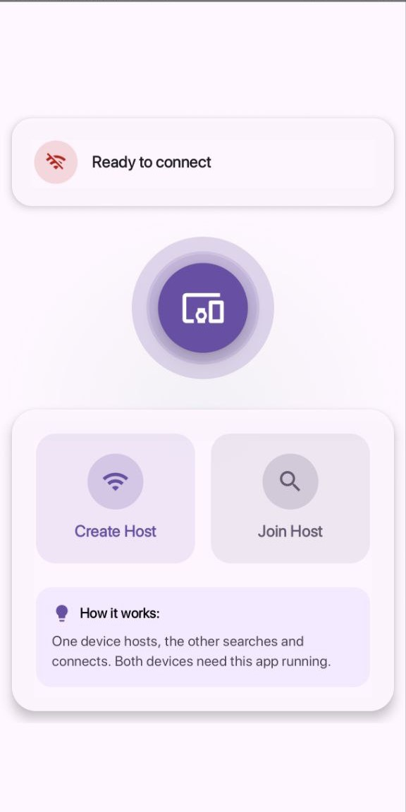
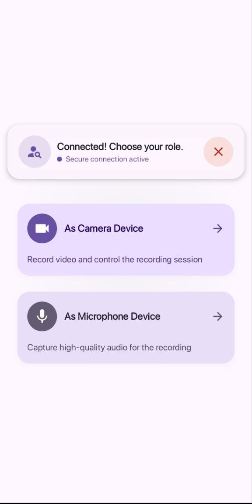
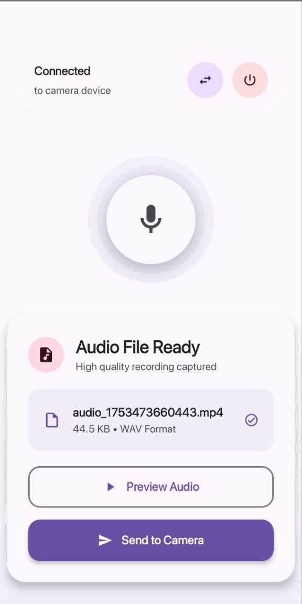
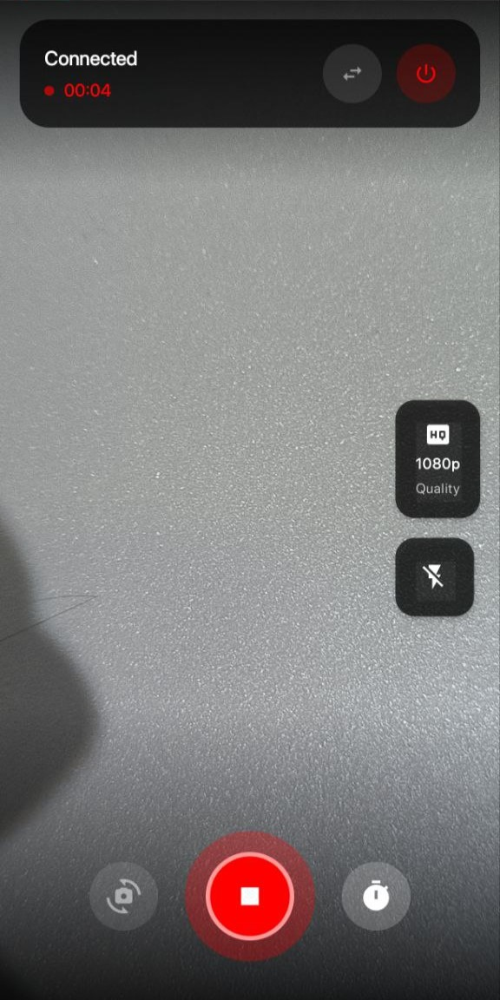

# Remote Mic 📱🎙️📹

<div align="right">

[](https://github.com/rahmanrezaee/remote_mic/releases/latest)
[](https://github.com/rahmanrezaee/remote_mic/releases)
[](LICENSE)

</div>

Transform two phones into a synchronized recording system - one as microphone, one as camera.


## ✨ Key Features

🔗 **P2P Connection** • 🎭 **Dynamic Roles** • 🎥 **4K Recording** • 🎙️ **Pro Audio** • 📁 **Auto Transfer** • 🎬 **Audio-Video Merge**

## 📸 Screenshots

| Connection | Role Selection | Camera |
|:----------:|:--------------:|:------:|
|  |  |  |

| Microphone | Recording | Merged |
|:----------:|:---------:|:------:|
|  |  |  |

## 🚀 Features

### 📡 Device Connection
- Direct P2P connection via Google Nearby API
- Host & search functionality
- Auto device discovery
- Encrypted communication

### 🎭 Role Management
- Choose Camera or Microphone role
- Switch roles without reconnecting
- Adaptive UI for each role

### 🎥 Camera Features
- 4K UHD, FHD, HD, SD quality options
- Front/rear camera switching
- Flash control (Auto/On/Off)
- Recording timer with countdown (1s, 3s, 5s, 10s)

### 🎙️ Audio Recording
- High-fidelity audio capture
- Synchronized with camera recording
- Real-time status display
- Audio visualization feedback

### 📁 File Management
- Automatic audio transfer to camera device
- Smart file organization
- Preview before merging
- File size optimization

### 🎬 Merging
- Seamless audio-video combination
- Professional output quality
- Interactive merge dialogs
- Multiple export formats

## 🎯 How to Use

### 1. Setup Connection
1. **Device A**: Open app → "Host Connection"
2. **Device B**: Open app → "Search for Devices" → Select Device A
3. Connection established automatically

### 2. Choose Roles
- Select **Camera** or **Microphone** on each device
- Interface adapts to your role

### 3. Record
- **Camera device**: Adjust settings → Optional timer → Record
- **Microphone device**: Recording starts automatically
- Stop on either device stops both

### 4. Merge Files
- Audio transfers to camera device automatically
- Choose "Continue Editing" or "Discard"
- Export merged video

## 🛠️ Technical Info

- **Language**: Kotlin 100%
- **UI**: Jetpack Compose
- **Architecture**: MVVM + StateFlow
- **Connection**: Google Nearby API
- **Camera**: CameraX
- **Audio**: MediaRecorder
- **Video Processing**: FFmpeg

### Requirements
- Android 7.0+ (API 24)
- Camera, microphone, storage permissions
- Location permission for device discovery
- 100MB+ free storage space

## 📱 Build from Source

### Prerequisites
- Android Studio Hedgehog or newer
- JDK 17+
- Android SDK 24+

### Build Instructions
```bash
# Clone repository
git clone https://github.com/rahmanrezaee/remote_mic.git
cd remote_mic

# Build debug APKs (all architectures)
./gradlew assembleDebug

# Build optimized release APKs (debug-signed)
./gradlew assembleRelease

# Build Android App Bundle
./gradlew bundleRelease

# Build specific architecture only (faster for development)
./gradlew assembleDebug -Pandroid.enableSeparateDeps=true